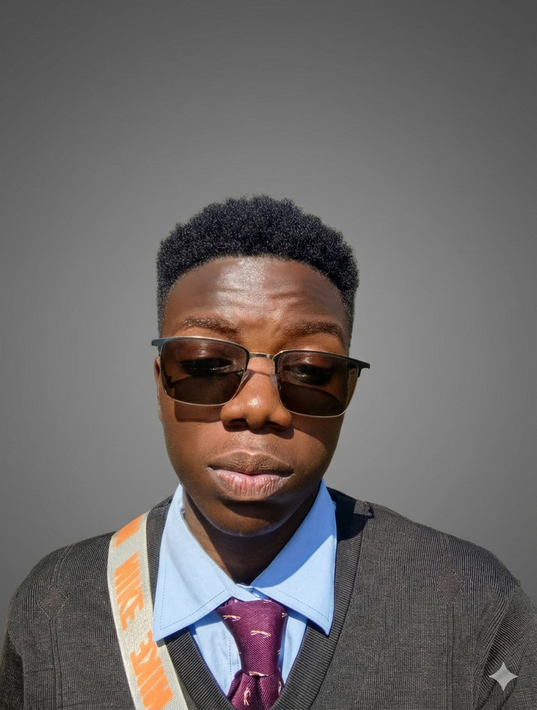

# Joel George Kaudzu · Medical-Tech Founder Portfolio

## 🚀 Overview

This is the official portfolio of **Joel George Kaudzu** — Premed Dental Surgery Student, Innovation Coordinator, Python Developer, and Medical-Tech Visionary. The portfolio showcases my journey, projects, leadership, and vision for transforming African healthcare through technology and disciplined innovation.

### 🔥 Live Site
[https://joelkaudzu.github.io](https://joelkaudzu.github.io)

## ✨ Features

- **Immersive Dark Theme** — Professional, tech-forward aesthetic
- **3D Interactive Background** — Medical-tech inspired visuals
- **Full Responsiveness** — Perfect on all devices
- **Project Showcase** — Detailed cards with filtering
- **Interactive Timeline** — Visual journey of innovation
- **Skill Bars** — Animated proficiency indicators
- **Contact Form** — Professional inquiry system
- **Blog Ready** — Structure for future articles
- **Optimized Performance** — Fast loading, SEO friendly

## 🛠️ Tech Stack

- **HTML5** — Semantic structure
- **CSS3** — Custom properties, animations, grid/flex
- **JavaScript** — Interactive components
- **Three.js** — 3D background effects
- **AOS** — Scroll animations
- **Font Awesome** — Icons
- **Google Fonts** — Typography

## 📁 Project Structure
